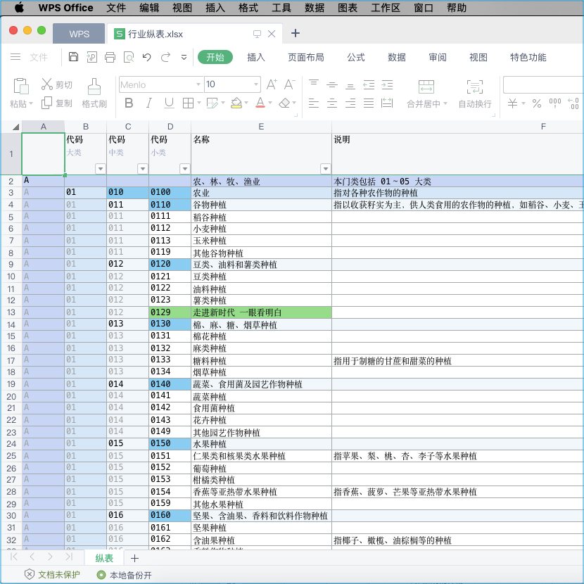
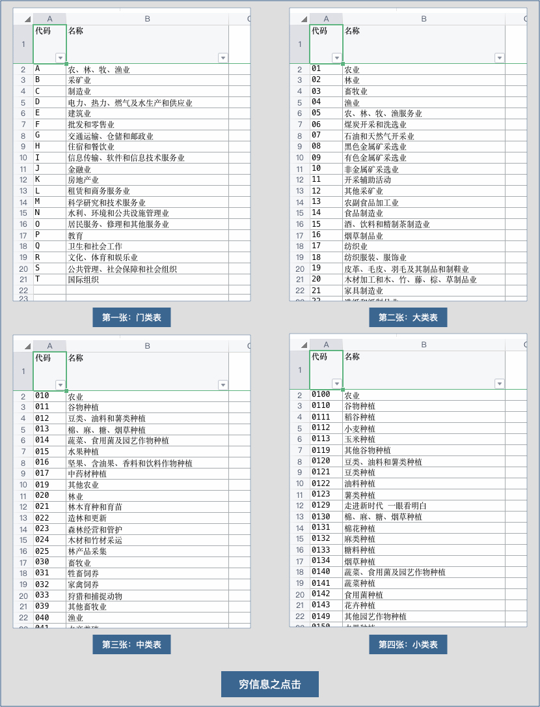
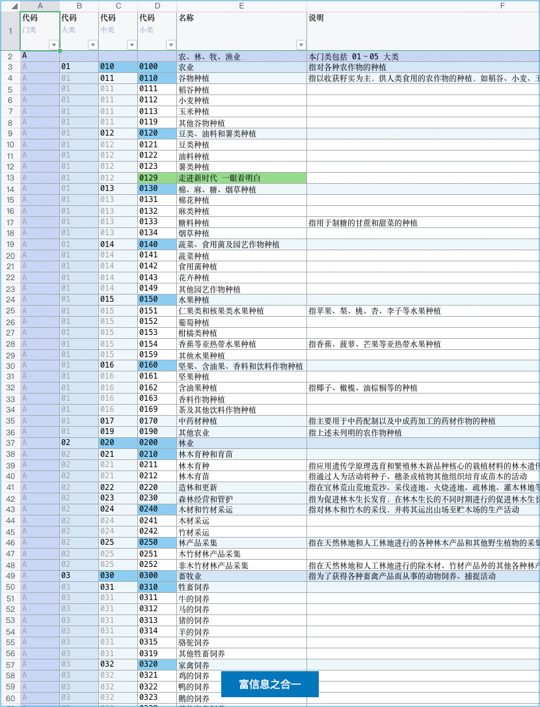

以东方文化为底蕴缔造轻奢认证机构管理系统 <br/>
适配高网速、符合时代，高维、上色、灵动 <br/>
主理人：麦修行（大江东去，唯我修行）

[麦修行][]&nbsp;&nbsp;&nbsp;&nbsp;[AI->东方神功][东方神功]&nbsp;[剧情][]&nbsp;[人物][]&nbsp;&nbsp;&nbsp;&nbsp;[原理][]&nbsp;&nbsp;[规则][]&nbsp;&nbsp;[价格][]&nbsp;&nbsp;[购买][]&nbsp;&nbsp;&nbsp;&nbsp;[Excel-Email][]&nbsp;[大模型-符文][]&nbsp;&nbsp;&nbsp;&nbsp;[发展历程][]

[麦修行]: https://github.com/ca3w/BEST
[东方神功]: https://github.com/ca3w/ai-dongfangshengong
[剧情]: https://github.com/ca3w/dongfangernvqing/blob/main/root/BEST.md
[人物]: https://github.com/ca3w/dongfangernvqing/blob/main/root/renwu.md
[原理]: https://github.com/ca3w/key
[规则]: https://github.com/ca3w/rule
[价格]: https://github.com/ca3w/pricing
[购买]: https://github.com/ca3w/howtobuy
[Excel-Email]: https://github.com/ca3w/excel-email
[大模型-符文]: https://github.com/ca3w/largemodel-rune
[发展历程]: https://github.com/ca3w/development

***

[神功][]：&nbsp;[九剑][]&nbsp;&nbsp;&nbsp;[飞针][]&nbsp;&nbsp;&nbsp;[莫言][]&nbsp;&nbsp;&nbsp;[神驭][]&nbsp;&nbsp;&nbsp;[归宗][]&nbsp;&nbsp;&nbsp;[万行][]&nbsp;&nbsp;&nbsp;[幻叶][]&nbsp;&nbsp;&nbsp;[密语][]&nbsp;&nbsp;&nbsp;[六彩][]&nbsp;&nbsp;&nbsp;[箭术][]&nbsp;&nbsp;&nbsp;[神意][]&nbsp;&nbsp;&nbsp;[千依][]&nbsp;&nbsp;&nbsp;[八音][]&nbsp;&nbsp;&nbsp;[道意][]&nbsp;&nbsp;&nbsp;|&nbsp;&nbsp;&nbsp;[兵法][]：&nbsp;[关中][]&nbsp;&nbsp;&nbsp;[治粟][]&nbsp;&nbsp;&nbsp;|&nbsp;&nbsp;&nbsp;[阵法][]：&nbsp;[清上][]

[神功]: https://github.com/ca3w/ai-dongfangshengong

[九剑]: ../../wugong/fuyaojiujian/BEST.md
[飞针]: ../../wugong/feizhenbaodian/BEST.md
[莫言]: ../../wugong/moyan/BEST.md
[神驭]: ../../wugong/shenyu/BEST.md
[归宗]: ../../wugong/baichuanguizong/BEST.md
[万行]: ../../wugong/yufengwanxing/BEST.md
[幻叶]: ../../wugong/huanyezhi/BEST.md
[密语]: ../../wugong/chenqiaomiyu/BEST.md
[六彩]: ../../wugong/liucaishenjian/BEST.md
[箭术]: ../../wugong/linjiajianshu/BEST.md
[神意]: ../../wugong/shenyiduoxinzhao/BEST.md
[千依]: ../../wugong/qianyizijian/BEST.md
[八音]: ../../wugong/bayinshengxin/BEST.md
[道意]: ../../wugong/daoyicuican/BEST.md

[兵法]: https://github.com/ca3w/ai-dongfangshengong#兵法目录

[关中]: ../../bingfa/guanzhongzhanfa/BEST.md
[治粟]: ../../bingfa/zhisubingfa/BEST.md

[阵法]: https://github.com/ca3w/ai-dongfangshengong#阵法目录

[清上]: ../../zhenfa/qingshangbeidouzhen/BEST.md

# 《关中战法》

简称：关中

## 传说

相传汉高祖刘邦定鼎天下后，将毕生征战心得著成此书，藏于未央宫密室，后辗转流入江湖，为各方势力所争夺

&nbsp;&nbsp;&nbsp;&nbsp;&nbsp;&nbsp;&nbsp;&nbsp;「楚亡汉兴之根要，不在共有之天时，不在封赏之人和，实在关中之地利！」

## 思想

系统根本不是数据库、代码那种表面上的东西，而是能和「现代环境」相配套的「现代作战体系」

两句话讲清楚这个「现代作战体系」 <br/>
用云得到高级体系、得到资源整合、得到生态发展，这三条没有云你是很难靠自己做到和实现的 <br/>
同时又依靠《关中战法》的文武表，《治粟兵法》的文件包，打造一条从云到本地的共享数据链

## 「认证机构信息管理系统」的「关中地利」是什么？

或者说是：认证机构的管理层，应该长期的、手握什么，才最靠谱？

答案是：重要数据集的、高维有颜色的、一眼看明白的文件：Excel

### 简单例子



这是真实的Excel，你可以自己下载看：[行业纵表](https://github.com/ca3w/ai-dongfangshengong/raw/refs/heads/main/root/bingfa/guanzhongzhanfa/static/行业纵表.xlsx "行业纵表")

它不是我手工弄的，它是我在系统中用「百川归宗」中的「一川归宗」，只按了1下、用了1秒种，轻而易举得到的
> 用 Excel 归档/备份 数据集的、高维的、有颜色的数据，效果非常好，但手工实现很不现实，必须是系统能刷的

这个表符合归档三要素：重要数据集、高维有颜色、一眼看明白 <br/>
也就是说：行业这一块，只归档这一张表就够用的，其余的不用 <br/>
可以把这张表设置「无相归宗」每天发到你指定的邮箱就可以了 <br/>
或者你到系统中把「无相归宗」的全部归档表格按年月日去下载

大概是这样的文件体系：

```text
/2025/01/01/基础代码/行业纵表.xlsx
/2025/01/01/基础代码/区划纵表.xlsx
/2025/01/01/基础代码/...
/2025/01/01/业务数据/体系纵表.xlsx
/2025/01/01/业务数据/产品纵表.xlsx
/2025/01/01/业务数据/...
...

/2025/01/02/基础代码/行业纵表.xlsx
/2025/01/02/基础代码/区划纵表.xlsx
/2025/01/02/基础代码/...
/2025/01/02/业务数据/体系纵表.xlsx
/2025/01/02/业务数据/产品纵表.xlsx
/2025/01/02/业务数据/...
...

/2025/01/03/基础代码/行业纵表.xlsx
/2025/01/03/基础代码/区划纵表.xlsx
/2025/01/03/基础代码/...
/2025/01/03/业务数据/体系纵表.xlsx
/2025/01/03/业务数据/产品纵表.xlsx
/2025/01/03/业务数据/...
...
```

实际的情况会有更高维的表格、更多数量的表格，按年月日系统每天按你自己设置的、按你自己神驭的，自动刷出 <br/>
建议你买「两块」「移动固态硬盘」，好一点的：1000M/s+，容量2T、或者大一点，还有《治粟兵法》中的文件

系统每天自动发到你的「无限容量邮箱」里一份，每月月初下载上月整个归档的压缩包，放到「移动固态硬盘」里 <br/>
为什么是「两块」「移动固态硬盘」？手动的raid1（更安全），就是每块硬盘都存一份，分两处放置，起容灾作用

这样你的「无限容量邮箱」有归档的高维表格（每天的），你的「移动固态硬盘」有归档的高维表格（按月打包的） <br/>
再配合《治粟兵法》所说的：粮仓存储单元的压缩包，实际上你本地有近乎完整的「数据文件体系」（按天整理的）

这种做法： <br/>
一般认知：你备份了数据文件 <br/>
较高理解：你实现了每日归档 <br/>
智者思维：你形成了追溯体系

#### 追溯体系的用途

当对数据有疑惑之时，怎么办？

一般来讲：基础数据使用「千依」这个高级功能，就可以良好进行数据追溯：非常直接的看清楚数据是怎么变幻的 <br/>
不过有时：事实摆在眼前，你也很难相信，你甚至非常确定是某些人动过的，上月我非常确定记得不是这个数据的

这很好办：从「无限容量邮箱」、「移动固态硬盘」里，把上月数据调出来，一看便知真相了，任何疑惑一查即破

### 凭什么「关中地利」是「Excel」，就不能是别的？

就凭四条，无可替代

#### 第一条：数据级安全、蓝星级生态

神马叫作「数据级安全」？ <br/>
&nbsp;&nbsp;&nbsp;&nbsp;&nbsp;&nbsp;&nbsp;&nbsp;自己动手，做个实验： <br/>
&nbsp;&nbsp;&nbsp;&nbsp;&nbsp;&nbsp;&nbsp;&nbsp;将上面下载的（或者任意你自己弄的Excel文件），更改后缀名：将后缀`行业纵表.xlsx`，改成为`行业纵表.zip` <br/>
&nbsp;&nbsp;&nbsp;&nbsp;&nbsp;&nbsp;&nbsp;&nbsp;解压（你电脑要安装有解压软件）得到文件夹：`行业纵表/` <br/>
&nbsp;&nbsp;&nbsp;&nbsp;&nbsp;&nbsp;&nbsp;&nbsp;用文本编辑器打开`行业纵表/xl/sharedStrings.xml` <br/>
&nbsp;&nbsp;&nbsp;&nbsp;&nbsp;&nbsp;&nbsp;&nbsp;自己看、自己琢磨：你的数据是不是都在这

「蓝星级生态」就是工具： <br/>
&nbsp;&nbsp;&nbsp;&nbsp;&nbsp;&nbsp;&nbsp;&nbsp;任何系统，都有工具： <br/>
&nbsp;&nbsp;&nbsp;&nbsp;&nbsp;&nbsp;&nbsp;&nbsp;Microsoft Excel、WPS Office、OpenOffice、Numbers（苹果）、甚至网页版的工具

#### 第二条：是国际标准、万年能打开

这样做，万年能打开： <br/>
&nbsp;&nbsp;&nbsp;&nbsp;&nbsp;&nbsp;&nbsp;&nbsp;把`行业纵表/xl/sharedStrings.xml`当作数据库 <br/>
&nbsp;&nbsp;&nbsp;&nbsp;&nbsp;&nbsp;&nbsp;&nbsp;把`能打开Excel的工具`当作小系统，蓝星有很多 <br/>
&nbsp;&nbsp;&nbsp;&nbsp;&nbsp;&nbsp;&nbsp;&nbsp;很多年后，你还能打开它

这样做，30年就废了： <br/>
&nbsp;&nbsp;&nbsp;&nbsp;&nbsp;&nbsp;&nbsp;&nbsp;如果把`程序级的 xxx.sql 真数据库`当作数据库 <br/>
&nbsp;&nbsp;&nbsp;&nbsp;&nbsp;&nbsp;&nbsp;&nbsp;如果把`你牢牢握在手里的一套小源码`当作小系统 <br/>
&nbsp;&nbsp;&nbsp;&nbsp;&nbsp;&nbsp;&nbsp;&nbsp;很多年后，你真的那么确定：你还能打开它？

只需30年真会沧海桑田：那套代码的编程语言、数据库，至少都迭代十余版了，甚至可能都淘汰了 <br/>
只怕今天的一键安装包，到那时会各种不兼容，就像你今天还想打开30年前MS-DOS里的东西一样

你在本地弄一套小系统，不可能永久长期使用，如果想依托这个备份重要数据，那只怕是不太科学 <br/>
Excel的背后是OOXML，是国际开放文档标准：它相当于大家都知道数据结构，各自开发操作工具

如果可能：当然是把符合国际开放文档标准的、大家都知道数据结构的`标准包`，攥在手里更科学些 <br/>
`标准包`就是`Excel文件`，所有为`标准包`开发工具的开发人员， 都知道上述`行业纵表/`里的数据结构

30年后、50年后，作为百年机构，想看看当年的表格： <br/>
如果你手里攥着的是`标准包`，哪怕沧海桑田、甚至翻天覆地，蓝星之上、自有工具，你能轻松打开 <br/>
如果你手里攥着的是`程序级的 xxx.sql`和`已经不兼容的一套小源码`，再想打开看看，只怕是不太容易

#### 第三条：表格形式的、单一文件的

Excel不仅是表格形式的，而且是单一文件的，本质是一些文本文件的压缩包，这种相对独立非常好 <br/>
只有这种数据级安全的， 国际标准的`标准包`，正好是表格的、相对独立好分离的，而且体量还不大

#### 第四条：现代富信息、结构化表格

这种非常适合归档数据， 适合长期攥在手里，正常来讲唯一的缺陷就是：表格不容易很好的结构化 <br/>
在以前使用穷信息系统， 就有这个致命缺陷，导致优势很难显现，使用富信息系统就没有这个问题 <br/>
富信息系统的数据很容易做到：和Excel的结构化数据1:1对等，系统表格自然可以1:1变成Excel表格 <br/>
这样手握Excel，握的就是数据集的、高维的、有颜色的表格，它是结构化表格，而不是碎片化表格

**结构化表格**远远好于**碎片化表格**，这极其的重要：「**一大堆**碎片化表格」比不了「**一张**结构化表格」 <br/>
**结构化表格**只不过是富信息极其重要的部分体现，关于「富信息有多重要」可以单独作为题目来论

### 富信息有多重要

富信息系统相对于穷信息系统，主要的优势有：高维、上色、灵动、更多高级

类型\优势                |高维         |上色        |灵动         |更多高级
-------------------------|-------------|------------|-------------|-------------
线上表格（武表）         |能够体现✅  |能够体现✅  |能够体现✅  |能够体现✅
本地表格（文表、Excel）  |能够体现✅  |能够体现✅  |不能体现❌  |不能体现❌

高维、上色的表格叫作「结构化表格」，没高维、没颜色的叫作「碎片化表格」 <br/>
下面仅拿武表、文表都能体现的高维、上色举例子，感受下这个优势有多重要

你、穷信息：碎片化表格（没高维、没颜色）、看四张表： <br/>


我、富信息：结构化表格（高维、上色）、看一张表： <br/>


你点东点西，忘南忘北的，看四张表的数据，怎么可能比得上：我四合一只看一张表、高维有颜色的 <br/>
你是在烧脑，脑力算高维，脑力想这个逻辑，而我烧的是CPU，我不费脑一眼看明白、而且是全局的 <br/>
就算局部的，你得想半天，你还可能记错了，这只是简单例子，如果换成更复杂点的，那你更不行了

不怕不识货，就怕货比货，同样的一块数据、尤其是复杂数据，穷信息的和富信息的，根本就没法比 <br/>
看穷信息表，极大脑力都浪费在结构化上了，你要想好好工作，脑子肯定在分析结构，在想逻辑关系 <br/>
看富信息表，瞬间懂结构、秒清楚逻辑关系，脑力更多想正事，工作品质会显著提高，不用点一大堆

这还没算线上武表的灵动，以及更多的高级，富信息对穷信息：新旧文明的降维打击，现代科技碾压

穷信息富信息的系统哲学： <br/>
之所以四处点击，是因为信息碎而不一，以点击寻之，以脑力结构之、逻辑之，虽力不至，是以厌烦 <br/>
之所以一页陶醉，是因为信息合而高维，以颜色明之，无脑力总揽之、全局之，不力即至，是以喜欢

&nbsp;&nbsp;&nbsp;&nbsp;&nbsp;&nbsp;&nbsp;&nbsp;&nbsp;&nbsp;&nbsp;&nbsp;&nbsp;&nbsp;&nbsp;&nbsp;&nbsp;&nbsp;&nbsp;&nbsp;&nbsp;&nbsp;&nbsp;&nbsp;&nbsp;&nbsp;&nbsp;&nbsp;&nbsp;&nbsp;&nbsp;&nbsp;&nbsp;&nbsp;&nbsp;**齐之技击，不可遇魏之武卒；魏之武卒，不可遇秦之锐士** <br/>
&nbsp;&nbsp;&nbsp;&nbsp;&nbsp;&nbsp;&nbsp;&nbsp;&nbsp;&nbsp;&nbsp;&nbsp;&nbsp;&nbsp;&nbsp;&nbsp;&nbsp;&nbsp;&nbsp;&nbsp;&nbsp;&nbsp;&nbsp;&nbsp;&nbsp;&nbsp;&nbsp;&nbsp;&nbsp;&nbsp;&nbsp;&nbsp;&nbsp;&nbsp;&nbsp;**穷之点击，不可遇富之合一；富之合一，不可遇神驭归宗**

&nbsp;&nbsp;&nbsp;&nbsp;&nbsp;&nbsp;&nbsp;&nbsp;啥意思： <br/>
&nbsp;&nbsp;&nbsp;&nbsp;&nbsp;&nbsp;&nbsp;&nbsp;&nbsp;&nbsp;&nbsp;&nbsp;&nbsp;&nbsp;&nbsp;&nbsp;任何一块： <br/>
&nbsp;&nbsp;&nbsp;&nbsp;&nbsp;&nbsp;&nbsp;&nbsp;&nbsp;&nbsp;&nbsp;&nbsp;&nbsp;&nbsp;&nbsp;&nbsp;穷之点击：做成穷信息点击的：零散很多表、一行一行的，靠人烧脑、将碎片化的信息合一 <br/>
&nbsp;&nbsp;&nbsp;&nbsp;&nbsp;&nbsp;&nbsp;&nbsp;&nbsp;&nbsp;&nbsp;&nbsp;&nbsp;&nbsp;&nbsp;&nbsp;富之合一：穷信息点击比不上：是富信息的、合而为一的，不费脑力、看结构化的全面信息 <br/>
&nbsp;&nbsp;&nbsp;&nbsp;&nbsp;&nbsp;&nbsp;&nbsp;&nbsp;&nbsp;&nbsp;&nbsp;&nbsp;&nbsp;&nbsp;&nbsp;神驭归宗：局部富信息比不上：全面富信息、任何表格都能用神驭自己调、用归宗1:1转文表

&nbsp;&nbsp;&nbsp;&nbsp;&nbsp;&nbsp;&nbsp;&nbsp;五绝凭什么是这五个，为什么万行是第六个： <br/>
&nbsp;&nbsp;&nbsp;&nbsp;&nbsp;&nbsp;&nbsp;&nbsp;&nbsp;&nbsp;&nbsp;&nbsp;&nbsp;&nbsp;&nbsp;&nbsp;九剑 + 飞针 = 结构化（视觉盛宴） <br/>
&nbsp;&nbsp;&nbsp;&nbsp;&nbsp;&nbsp;&nbsp;&nbsp;&nbsp;&nbsp;&nbsp;&nbsp;&nbsp;&nbsp;&nbsp;&nbsp;莫言 = 灵动（酷炫） <br/>
&nbsp;&nbsp;&nbsp;&nbsp;&nbsp;&nbsp;&nbsp;&nbsp;&nbsp;&nbsp;&nbsp;&nbsp;&nbsp;&nbsp;&nbsp;&nbsp;神驭 + 归宗 = 武转文（霸气神奇） <br/>
&nbsp;&nbsp;&nbsp;&nbsp;&nbsp;&nbsp;&nbsp;&nbsp;&nbsp;&nbsp;&nbsp;&nbsp;&nbsp;&nbsp;&nbsp;&nbsp;&nbsp;&nbsp;&nbsp;&nbsp;&nbsp;&nbsp;&nbsp;&nbsp;武转文（线上表格 1:1转为 本地Excel）： <br/>
&nbsp;&nbsp;&nbsp;&nbsp;&nbsp;&nbsp;&nbsp;&nbsp;&nbsp;&nbsp;&nbsp;&nbsp;&nbsp;&nbsp;&nbsp;&nbsp;&nbsp;&nbsp;&nbsp;&nbsp;&nbsp;&nbsp;&nbsp;&nbsp;&nbsp;&nbsp;&nbsp;&nbsp;&nbsp;&nbsp;&nbsp;&nbsp;想调整：用神驭自己调 <br/>
&nbsp;&nbsp;&nbsp;&nbsp;&nbsp;&nbsp;&nbsp;&nbsp;&nbsp;&nbsp;&nbsp;&nbsp;&nbsp;&nbsp;&nbsp;&nbsp;&nbsp;&nbsp;&nbsp;&nbsp;&nbsp;&nbsp;&nbsp;&nbsp;&nbsp;&nbsp;&nbsp;&nbsp;&nbsp;&nbsp;&nbsp;&nbsp;随时转：一叶归宗、一川归宗、集剑归宗 <br/>
&nbsp;&nbsp;&nbsp;&nbsp;&nbsp;&nbsp;&nbsp;&nbsp;&nbsp;&nbsp;&nbsp;&nbsp;&nbsp;&nbsp;&nbsp;&nbsp;&nbsp;&nbsp;&nbsp;&nbsp;&nbsp;&nbsp;&nbsp;&nbsp;&nbsp;&nbsp;&nbsp;&nbsp;&nbsp;&nbsp;&nbsp;&nbsp;每天转：无相归宗 <br/>
&nbsp;&nbsp;&nbsp;&nbsp;&nbsp;&nbsp;&nbsp;&nbsp;&nbsp;&nbsp;&nbsp;&nbsp;&nbsp;&nbsp;&nbsp;&nbsp;第六神功：万行（豪情），自己控制吞吐量级

&nbsp;&nbsp;&nbsp;&nbsp;&nbsp;&nbsp;&nbsp;&nbsp;&nbsp;&nbsp;&nbsp;&nbsp;&nbsp;&nbsp;&nbsp;&nbsp;所有的这一切，全部都用AI高品质、快速实现！

## 文武表理论

对于认证机构现代信息数据， <br/>
长治久安的管理理念是什么？

&nbsp;&nbsp;&nbsp;&nbsp;&nbsp;&nbsp;&nbsp;&nbsp;&nbsp;&nbsp;&nbsp;&nbsp;&nbsp;&nbsp;&nbsp;&nbsp;&nbsp;&nbsp;&nbsp;&nbsp;&nbsp;&nbsp;&nbsp;&nbsp;&nbsp;&nbsp;&nbsp;&nbsp;&nbsp;&nbsp;&nbsp;&nbsp;&nbsp;&nbsp;&nbsp;&nbsp;&nbsp;&nbsp;&nbsp;&nbsp;&nbsp;&nbsp;**持文用武 以武化文**

#### 文表武表

文表：区分「普通Excel」的命名，富信息的、结构化的，才叫文表 <br/>
武表：线上的表， 富信息、能用东方神功中的武功，所以才叫武表

#### 持文用武

持文：文表、Excel表，富信息的、结构化的，文文静静、攥在手里 <br/>
用武：武表、线上表， 富信息的、结构化的，使用武功、灵动酷炫

#### 以武化文

必须依靠系统，把武表1:1转化成文表，这样才能得到文表（富信息） <br/>
Excel表，纯靠手搓，也能弄成高维的，也能弄的有颜色，但不现实

用神驭（实调），把线上武表调好了，要哪列不要哪列，多少宽度 <br/>
想要文表时，百川归宗，瞬间就好了，数据都是最新的，甚至无相

#### 管理理念

无论文表，还是武表，内在现代核心都是：富信息（高维、有颜色）

不在于使用谁的系统，而是对管理理念的深度思考：「持文用武」 <br/>
&nbsp;&nbsp;&nbsp;&nbsp;&nbsp;&nbsp;&nbsp;&nbsp;手里抓的：**富信息化**的Excel <br/>
&nbsp;&nbsp;&nbsp;&nbsp;&nbsp;&nbsp;&nbsp;&nbsp;线上用的：**富信息化**的表格

## 未来大趋势

&nbsp;&nbsp;&nbsp;&nbsp;&nbsp;&nbsp;&nbsp;&nbsp;&nbsp;&nbsp;&nbsp;&nbsp;&nbsp;&nbsp;&nbsp;&nbsp;&nbsp;&nbsp;&nbsp;&nbsp;&nbsp;&nbsp;&nbsp;&nbsp;&nbsp;&nbsp;&nbsp;&nbsp;&nbsp;&nbsp;&nbsp;&nbsp;&nbsp;&nbsp;&nbsp;&nbsp;&nbsp;&nbsp;&nbsp;&nbsp;&nbsp;&nbsp;**信息化 -> 富信息化**

从过去的**信息化**的小系统，换成新的**富信息化**的大系统，这就是未来大趋势！

以前是初步信息化，以及真正的变革点还没有到，所以老旧系统有三道封印： <br/>
&nbsp;&nbsp;&nbsp;&nbsp;&nbsp;&nbsp;&nbsp;&nbsp;&nbsp;&nbsp;&nbsp;&nbsp;&nbsp;&nbsp;&nbsp;&nbsp;&nbsp;&nbsp;&nbsp;&nbsp;&nbsp;&nbsp;&nbsp;&nbsp;&nbsp;&nbsp;&nbsp;&nbsp;&nbsp;&nbsp;&nbsp;&nbsp;&nbsp;&nbsp;&nbsp;**不能高维、不能颜色、不能灵动** <br/>
只有解除三道封印，只有重新上系统、重新武装，才是真正的现代系统形态！

***

## 现实世界

认证机构信息管理系统 中的 「富信息」

## 武侠世界

天下第一奇书

## 术语对照

兵法术语  |系统术语    |说明                                                          |大白话
:---------|:-----------|:-------------------------------------------------------------|:-----------------------------
关中      |文表、持文  |持**富信息**的Excel表格，家里的文表、文文静静，好看           |反正家里非常安全
关外      |武表、用武  |用**富信息**的线上表格， 云上的武表，能用武功，好用           |那就出去放开了打（使用云端）
**三秦**  |被限制      |**三秦：不能高维、不能颜色、不能灵动**                        |
**封印**  |被限制      |**封印：不能高维、不能颜色、不能灵动**                        |
逐鹿中原  |富信息化    |谁能良好的转化「时代之力」，走向富信息，如大破三秦，赢得时代  |
永居巴蜀  |抱守穷信息  |没有远见、无视「时代巨变」，还小页蛮点，如龙且渡水，必败无疑  |

## 作者笔记

```text
2025年以后，认证机构上系统，还执着于穷信息，无视富信息趋势，这相当于什么？

就相当于没有血性、放弃进取、画地自限、永居巴蜀，天下大势已经和你没关系了。

2025年以后，富信息大战开启，就是看谁能良好蜕变为富信息系统，做到与时俱进！

初步信息化，相当于推翻暴秦，
抱守穷信息，相当于永居巴蜀，无非是一些表，点来点去的，不可能有什么大作为！
进取富信息，相当于离开巴蜀，相当于破三秦，富信息才是真正的系统、终成大器！

未来的系统，不可能是穷信息，一定是富信息的，这一点毫无疑问，天下大势已定！

如大破三秦：
    格局为三秦所困：不能高维、不能颜色、不能灵动
    只有破了这三秦，才是突破限制，一切才刚刚开始

如龙且渡水：
    你一页、一页的，点来点去，还是很小的页（<1M）
    别人的富信息表格，一个万行，数据量可能：100M

    结构高维、颜色美感、信息密度、聚合灵动......
    只怕是没一样比得了，别人对你是降维碾压......
```
