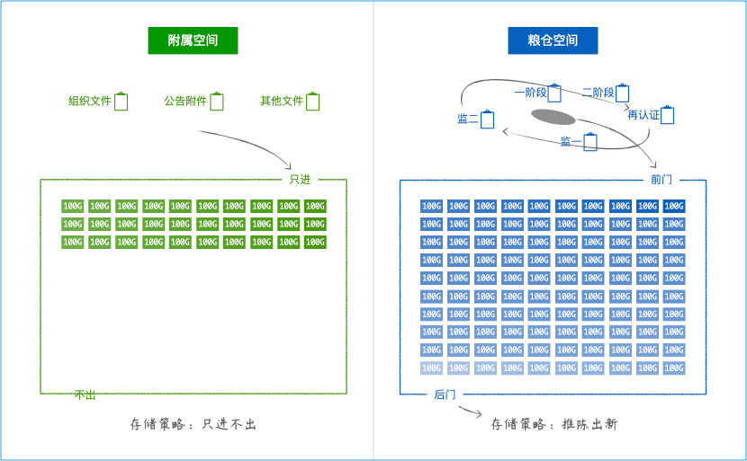

适配高网速、好电脑的，认证机构信息管理系统 <br/>
清爽、高级、惊艳、生态，新时代的驾驭感 <br/>
主理人：麦修行（大江东去，唯我修行）

[麦修行][]&nbsp;&nbsp;&nbsp;&nbsp;[AI->东方神功][东方神功]&nbsp;[剧情][]&nbsp;[人物][]&nbsp;&nbsp;&nbsp;&nbsp;[原理][]&nbsp;&nbsp;[规则][]&nbsp;&nbsp;[价格][]&nbsp;&nbsp;[购买][]&nbsp;&nbsp;&nbsp;&nbsp;[高奢团][]&nbsp;&nbsp;&nbsp;&nbsp;[发展历程][]

[麦修行]: https://github.com/ca3w/BEST
[东方神功]: https://github.com/ca3w/ai-dongfangshengong
[剧情]: https://github.com/ca3w/dongfangernvqing/blob/main/root/BEST.md
[人物]: https://github.com/ca3w/dongfangernvqing/blob/main/root/renwu.md
[原理]: https://github.com/ca3w/key
[规则]: https://github.com/ca3w/rule
[价格]: https://github.com/ca3w/pricing
[购买]: https://github.com/ca3w/howtobuy
[高奢团]: https://github.com/ca3w/tuan
[发展历程]: https://github.com/ca3w/development

***

[神功][]：&nbsp;[九剑][]&nbsp;&nbsp;&nbsp;[飞针][]&nbsp;&nbsp;&nbsp;[莫言][]&nbsp;&nbsp;&nbsp;[神驭][]&nbsp;&nbsp;&nbsp;[归宗][]&nbsp;&nbsp;&nbsp;[万行][]&nbsp;&nbsp;&nbsp;[幻叶][]&nbsp;&nbsp;&nbsp;[密语][]&nbsp;&nbsp;&nbsp;[六彩][]&nbsp;&nbsp;&nbsp;[箭术][]&nbsp;&nbsp;&nbsp;[神意][]&nbsp;&nbsp;&nbsp;[千依][]&nbsp;&nbsp;&nbsp;[八音][]&nbsp;&nbsp;&nbsp;[道意][]&nbsp;&nbsp;&nbsp;|&nbsp;&nbsp;&nbsp;[兵法][]：&nbsp;[关中][]&nbsp;&nbsp;&nbsp;[治粟][]&nbsp;&nbsp;&nbsp;|&nbsp;&nbsp;&nbsp;[阵法][]：&nbsp;[清上][]

[神功]: https://github.com/ca3w/ai-dongfangshengong

[九剑]: ../../wugong/fuyaojiujian/BEST.md
[飞针]: ../../wugong/feizhenbaodian/BEST.md
[莫言]: ../../wugong/moyan/BEST.md
[神驭]: ../../wugong/shenyu/BEST.md
[归宗]: ../../wugong/baichuanguizong/BEST.md
[万行]: ../../wugong/yufengwanxing/BEST.md
[幻叶]: ../../wugong/huanyezhi/BEST.md
[密语]: ../../wugong/chenqiaomiyu/BEST.md
[六彩]: ../../wugong/liucaishenjian/BEST.md
[箭术]: ../../wugong/linjiajianshu/BEST.md
[神意]: ../../wugong/shenyiduoxinzhao/BEST.md
[千依]: ../../wugong/qianyizijian/BEST.md
[八音]: ../../wugong/bayinshengxin/BEST.md
[道意]: ../../wugong/daoyicuican/BEST.md

[兵法]: https://github.com/ca3w/ai-dongfangshengong#兵法目录

[关中]: ../../bingfa/guanzhongzhanfa/BEST.md
[治粟]: ../../bingfa/zhisubingfa/BEST.md

[阵法]: https://github.com/ca3w/ai-dongfangshengong#阵法目录

[清上]: ../../zhenfa/qingshangbeidouzhen/BEST.md

# 《治粟兵法》

简称：治粟

## 传说

相传韩信做治粟都尉时所著兵书，萧何仅阅数篇便以性命保韩信为大将军，后辗转流入江湖，为各方势力所争夺

&nbsp;&nbsp;&nbsp;&nbsp;&nbsp;&nbsp;&nbsp;&nbsp;「治粟如治兵，万事如此，贵在变通。」

## 思想

系统根本不是数据库、代码那种表面上的东西，而是能和「现代环境」相配套的「现代作战体系」

两句话讲清楚这个「现代作战体系」 <br/>
用云得到高级体系、得到资源整合、得到生态发展，这三条没有云你是很难靠自己做到和实现的 <br/>
同时又依靠《关中战法》的文武表，《治粟兵法》的文件包，打造一条从云到本地的共享数据链

## 文件空间

文件空间分为「附属空间」和「粮仓空间」两种：

空间类型  |存储策略  |说明&nbsp;&nbsp;&nbsp;&nbsp;&nbsp;&nbsp;&nbsp;&nbsp;&nbsp;&nbsp;&nbsp;&nbsp;&nbsp;&nbsp;&nbsp;&nbsp;&nbsp;&nbsp;&nbsp;&nbsp;&nbsp;&nbsp;&nbsp;&nbsp;&nbsp;&nbsp;&nbsp;&nbsp;&nbsp;&nbsp;&nbsp;&nbsp;&nbsp;&nbsp;&nbsp;&nbsp;&nbsp;&nbsp;&nbsp;&nbsp;&nbsp;&nbsp;&nbsp;&nbsp;
----------|----------|:---------------
附属空间  |只进不出  |存储附属类文件
粮仓空间  |推陈出新  |存储粮仓类文件

#### 附属类文件

和认证业务、认证周期无关的：组织文件、公告附件等文件

#### 粮仓类文件

和认证业务、认证周期相关的：申请资料、审核报告等文件

## 存储单元

每大约100G的存储空间，划分成为一个存储单元
> 大约100G：就是大体接近，由算法去具体判定

#### 机构配额

容量类型  |单元数量  |说明&nbsp;&nbsp;&nbsp;&nbsp;&nbsp;&nbsp;&nbsp;&nbsp;&nbsp;&nbsp;&nbsp;&nbsp;&nbsp;&nbsp;&nbsp;&nbsp;&nbsp;&nbsp;&nbsp;&nbsp;&nbsp;&nbsp;&nbsp;&nbsp;&nbsp;&nbsp;&nbsp;&nbsp;&nbsp;&nbsp;&nbsp;&nbsp;&nbsp;&nbsp;&nbsp;&nbsp;&nbsp;&nbsp;&nbsp;&nbsp;&nbsp;&nbsp;&nbsp;&nbsp;
----------|----------|:----------------
年费容量  |30        |30 x 100G  = 3T
整合容量  |X         |
付费扩容  |Y         |

随着资源整合，容量越来越大，见：[资源整合策略][]

[资源整合策略]: https://github.com/ca3w/rule/#资源整合策略

#### 自动打包

每装满一个存储单元，系统会将其自动压缩打包

#### 对象存储OSS

尚未打包的存储单元，以及你可能尚未及时下载的存储单元 <br/>
系统会把相应的文件，进行对象存储OSS，以全文武表理论

容量类型  |存储单元  |说明&nbsp;&nbsp;&nbsp;&nbsp;&nbsp;&nbsp;&nbsp;&nbsp;&nbsp;&nbsp;&nbsp;&nbsp;&nbsp;&nbsp;&nbsp;&nbsp;&nbsp;&nbsp;&nbsp;&nbsp;&nbsp;&nbsp;&nbsp;&nbsp;&nbsp;&nbsp;&nbsp;&nbsp;&nbsp;&nbsp;&nbsp;&nbsp;&nbsp;&nbsp;&nbsp;&nbsp;&nbsp;&nbsp;&nbsp;&nbsp;&nbsp;&nbsp;&nbsp;&nbsp;
----------|----------|:-----------------------
附属空间  |当前正用  |尚未打包的（还没装满）
附属空间  |最新打包  |你可能尚未及时下载的
粮仓空间  |当前正用  |尚未打包的（还没装满）
粮仓空间  |最新打包  |你可能尚未及时下载的

## 存储原理

系统每收到一个文件，会把文件存储在当前正用的存储单元 <br/>
然后判断是否已装满，如果装满则会注册一个新的存储单元

系统自动将已经满的，尚未打包的存储单元，自动压缩打包

对象存储OSS： <br/>
所有新上传的文件会在两分钟内，自动上传到对象存储OSS <br/>
系统自动清理陈旧对象存储OSS，已经打包的且你已下载的

## 粮仓单元推陈出新



就像韩信管理粮仓时的「推陈出新」一样，管理认证周期（初审、监一、监二... 再认证）持续产生的相关文件 <br/>
推陈、推出去的，服务器上虽然没有文件，但你手上有压缩包，都是「几个认证周期以前/二三十年前」的文件

无论本地的文表，还是线上的武表，数据如果链接文件，都可以根据其规律，很容易找到对应的压缩包及文件

这样做的目的是：很好的梳理文件，不仅在云端有文件，还可以用很低的价格，只存储非常重要文件，淘汰陈旧 <br/>
同时在本地硬盘，也能很好的备份，进一步强化文武表，文表如果有链接文件，也能在压缩包内找到，一举多得

```text
要以发展的、长远的、未来的眼光，去构思去设计一切

容量知识：
    一张照片
        2010年以前：100KB-1MB
        2015年以前：1MB-2MB
        2020年以前：2MB-4MB
        2025年现在：4MB-8MB
        以后，一张照片 100MB 不是不可能 是一定会

    那系统呢？
        以前穷信息系统：200MB（把上传的文件去除，代码不会太大）
        以后富信息系统：2G-5G（可能更大）

一定如此：你今天不把一切梳理的有模有样，等到几十年后，回头一看信息化：数据是一堆、乱糟糟，文件又是一堆、也乱糟糟

等到几十年后：

    那么大的机构、那么多人、干了一辈子，所谓信息化：
        说数据、数据没高维没颜色，反正是一大堆
        说文件、文件没打捆没打包，反正也是一堆
        后继之君：溃矣！
            上一辈人没正事，整的这都是啥啊？
            有诗可叹：

                《穷信息 · 巴蜀》
            三十功名尘与土，八千里路土与尘。
            百年数据尘归尘，一路遭罪土归土。

    你在看别人呢：把一切梳理的有模有样，真正信息化：
        数据，高维的、有颜色的，文是文，武是武
        文件，打成捆、还压成包，盘里有，云上有
        文表18G富信息历年数据，文件是18T装盘
        后继之君：福泽深厚，底蕴悠长！
            上一辈人的系统，下一辈人还在用。
            有诗可诵：

                《富信息 · 中原》
            三十功名尘与土，八千里路云和月。
            百年数据旧文件，一路艰辛刻沧桑。

    道理就是：
        穷信息只是个过渡，只是探路式的草创系统
        一切沧桑中的美好，真的只能由富信息刻下

        要么这辈人跨时代、就换成富信息，刻下沧桑、等下辈人歌诵你
        要么这辈人窝巴蜀、坚持用穷信息，一路遭罪、等下辈人忘记你、等到下辈人换成富信息

            等到下辈人，或许富信息就不会那么贵了，我相信最终的美好、一定会属于他们

    你也可以：
        这一代人，就跨时代、就上富信息系统，就开创福泽后世之功业

```

***

## 现实世界

认证机构信息管理系统 中的 「文件存储」

## 武侠世界

天下第一兵法

## 术语对照

兵法术语  |系统术语    |说明
:---------|:-----------|:-------------------------------------
治粟      |治理文件    |治理认证周期中产生的文件
粮食包    |存储单元    |韩信「推陈出新」成语中的「一袋粮食」

## 作者笔记

```text
什么叫作「一路遭罪」
    明明发展到了CPU能干的活（结构化：高维、上色），你还靠脑力、你遭罪

什么叫作「跨时代」
    别人遭罪，才得到的成果，你多花点钱就直接享受成果，你享受、超前享受
```
