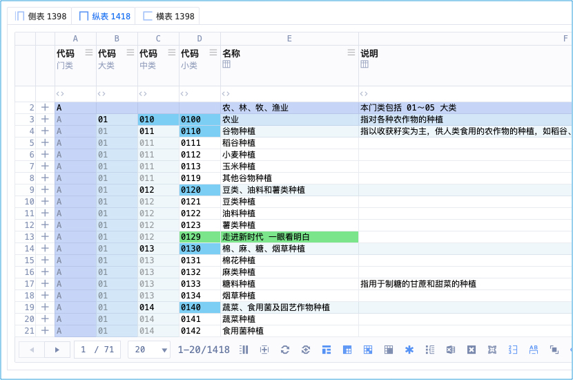
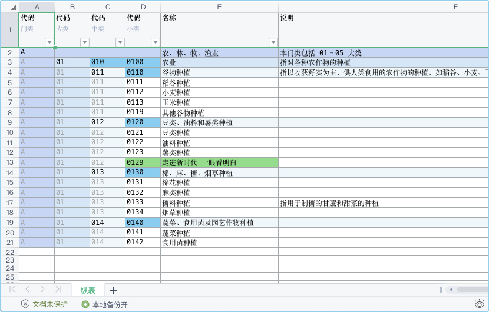
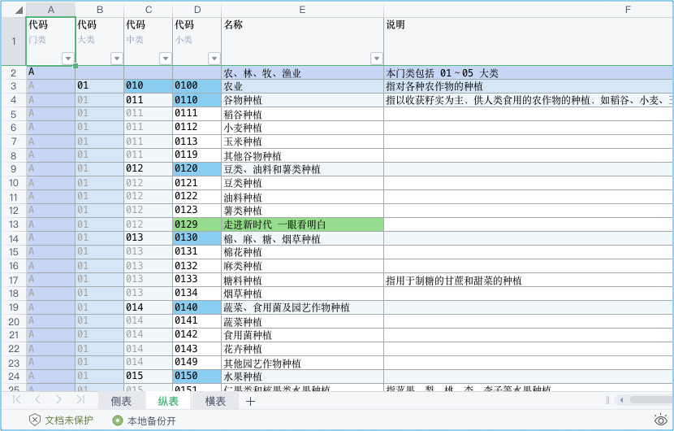

以东方文化为底蕴缔造轻奢认证机构管理系统 <br/>
适配高网速、符合时代，高维、上色、灵动 <br/>
主理人：麦修行（大江东去，唯我修行）

[麦修行][]&nbsp;&nbsp;&nbsp;&nbsp;[AI->东方神功][东方神功]&nbsp;[剧情][]&nbsp;[人物][]&nbsp;&nbsp;&nbsp;&nbsp;[原理][]&nbsp;&nbsp;[规则][]&nbsp;&nbsp;[价格][]&nbsp;&nbsp;[购买][]&nbsp;&nbsp;&nbsp;&nbsp;[Excel-Email][]&nbsp;[大模型-符文][]&nbsp;&nbsp;&nbsp;&nbsp;[发展历程][]

[麦修行]: https://github.com/ca3w/BEST
[东方神功]: https://github.com/ca3w/ai-dongfangshengong
[剧情]: https://github.com/ca3w/dongfangernvqing/blob/main/root/BEST.md
[人物]: https://github.com/ca3w/dongfangernvqing/blob/main/root/renwu.md
[原理]: https://github.com/ca3w/key
[规则]: https://github.com/ca3w/rule
[价格]: https://github.com/ca3w/pricing
[购买]: https://github.com/ca3w/howtobuy
[Excel-Email]: https://github.com/ca3w/excel-email
[大模型-符文]: https://github.com/ca3w/largemodel-rune
[发展历程]: https://github.com/ca3w/development

***

[神功][]：&nbsp;[九剑][]&nbsp;&nbsp;&nbsp;[飞针][]&nbsp;&nbsp;&nbsp;[莫言][]&nbsp;&nbsp;&nbsp;[神驭][]&nbsp;&nbsp;&nbsp;[归宗][]&nbsp;&nbsp;&nbsp;[万行][]&nbsp;&nbsp;&nbsp;[幻叶][]&nbsp;&nbsp;&nbsp;[密语][]&nbsp;&nbsp;&nbsp;[六彩][]&nbsp;&nbsp;&nbsp;[箭术][]&nbsp;&nbsp;&nbsp;[神意][]&nbsp;&nbsp;&nbsp;[千依][]&nbsp;&nbsp;&nbsp;[八音][]&nbsp;&nbsp;&nbsp;[道意][]&nbsp;&nbsp;&nbsp;|&nbsp;&nbsp;&nbsp;[兵法][]：&nbsp;[关中][]&nbsp;&nbsp;&nbsp;[治粟][]&nbsp;&nbsp;&nbsp;|&nbsp;&nbsp;&nbsp;[阵法][]：&nbsp;[清上][]

[神功]: https://github.com/ca3w/ai-dongfangshengong

[九剑]: ../../wugong/fuyaojiujian/BEST.md
[飞针]: ../../wugong/feizhenbaodian/BEST.md
[莫言]: ../../wugong/moyan/BEST.md
[神驭]: ../../wugong/shenyu/BEST.md
[归宗]: ../../wugong/baichuanguizong/BEST.md
[万行]: ../../wugong/yufengwanxing/BEST.md
[幻叶]: ../../wugong/huanyezhi/BEST.md
[密语]: ../../wugong/chenqiaomiyu/BEST.md
[六彩]: ../../wugong/liucaishenjian/BEST.md
[箭术]: ../../wugong/linjiajianshu/BEST.md
[神意]: ../../wugong/shenyiduoxinzhao/BEST.md
[千依]: ../../wugong/qianyizijian/BEST.md
[八音]: ../../wugong/bayinshengxin/BEST.md
[道意]: ../../wugong/daoyicuican/BEST.md

[兵法]: https://github.com/ca3w/ai-dongfangshengong#兵法目录

[关中]: ../../bingfa/guanzhongzhanfa/BEST.md
[治粟]: ../../bingfa/zhisubingfa/BEST.md

[阵法]: https://github.com/ca3w/ai-dongfangshengong#阵法目录

[清上]: ../../zhenfa/qingshangbeidouzhen/BEST.md

# 百川归宗

简称：归宗

## 石壁有字

&nbsp;&nbsp;&nbsp;&nbsp;&nbsp;&nbsp;&nbsp;&nbsp;&nbsp;&nbsp;&nbsp;&nbsp;&nbsp;&nbsp;&nbsp;&nbsp;&nbsp;&nbsp;&nbsp;&nbsp;&nbsp;&nbsp;&nbsp;&nbsp;&nbsp;《百川归宗》 <br/>
&nbsp;&nbsp;&nbsp;&nbsp;&nbsp;&nbsp;&nbsp;&nbsp;百川东去远山明，长风乱石飞鸟惊。 <br/>
&nbsp;&nbsp;&nbsp;&nbsp;&nbsp;&nbsp;&nbsp;&nbsp;归宗清平会有时，断弦残曲知音听。

## 一叶归宗

线上武表（系统、能用武功的、高级的）： <br/>


线下文表（Excel、文文静静的、好看的）： <br/>

> 一叶归宗：一页（叶）归使用者（宗） <br/>
> 无论你对线上表格怎么操作，这个线上表格都能1:1变成Excel表格 <br/>
> 此功能画面太多，图片不足以表现，抖音西瓜、微信的视频号，搜 ca3wBEST / ca3w麦修行 看视频

## 一川归宗


> 一川归宗：一个表格（川）归使用者（宗） <br/>
> 无论你对线上表格怎么操作，这个线上表格都能1:1变成Excel表格 <br/>
> 此功能画面太多，图片不足以表现，抖音西瓜、微信的视频号，搜 ca3wBEST / ca3w麦修行 看视频

## 集剑归宗


> 集剑归宗：集合多个表格（剑）归使用者（宗） <br/>
> 无论你对线上表格怎么操作，这个线上表格都能1:1变成Excel表格 <br/>
> 此功能画面太多，图片不足以表现，抖音西瓜、微信的视频号，搜 ca3wBEST / ca3w麦修行 看视频

## 无相归宗

没有任何表相 任何文表归你
> 无相归宗：无相就是没有实相（佛教术语）的意思，什么都不用你做，（页/表格/多个表格）归使用者（宗） <br/>
> 无论你对线上表格怎么操作，这个线上表格都能1:1变成Excel表格

***

## 现实世界

认证机构信息管理系统 中的 「导出」

> 导出Excel，一叶/一川/集剑=非常高级的导出Excel，无相=线上武表和本地文表建立起对等关联

## 武侠世界

天下第一内功 <br/>
五绝：中禅师 · 觉空禅师 成名绝技 <br/>
穿越主（审核员东方正美）在第二次营救行动前，于「大慈悲寺」拜佛之时， <br/>
觉空禅师基于李煜有恩于「大慈悲寺」、自己发过誓不涉江湖、见穿越主一身正气等多方面的原因， <br/>
将各方势力都觊觎的天下第一兵书《治粟兵法》，和武林人士都觊觎的天下第一内功《百川归宗》一并都交付给穿越主了， <br/>
随后带到密室竟将自己70年功力一并传于穿越主，欲报深恩、寄希望于穿越主能够顺利救出李煜，而后觉空禅师便圆寂了......

## 术语对照

武学术语  |系统术语    |说明
:---------|:-----------|:-------------------------------------------------------------------------------------
归宗      |导出        |导出Excel
百川归宗  |百表导出    |川是表（表就是山川、山川就是表）
一叶归宗  |一页导出    |叶通页
一川归宗  |一表导出    |川是表
集剑归宗  |集表导出    |剑是表（表就是剑、剑就是表）
无相归宗  |无操作导出  |按你神驭的（要哪列、多宽等，你自己调）、按你设置的（要哪个表、不要哪个），武表转文表

无相归宗，是《文武表理论》的践行高级武功，还包括和文件的对应，请结合「兵法」理解 <br/>
会在你本地形成一套「Excel+文件包」的组合，那里面有重要的数据，你有这个放心用云端

## 作者笔记

```text
导出的Excel，永远和你所见的「情形」一摸一样
    「情形」包括：神驭/虚界（前后宽高、显隐）、雕栏破碎、飞针、大行、星注等等

说白了就是：「文表」是「武表」变的，变的那一刻：「武表」是什么样，那变的「文表」就会是什么样
    文表：导出的Excel、文文静静的
    武表：线上的表格、能用武功的

举例就是：
    你把某个列（任何），调宽调成150，归宗导出的Excel，列宽就是150
        再调成300，那导出的Excel，就是300
    雕栏破碎调成「碎态」，那导出的就是「碎态」
    飞针调成「有颜色的」，那导出的就是「有颜色的」
    大行调成「大行模式」，那导出的就是「大行模式」
    星注调成「有注释的」，那导出的就是「有注释的」

一句：「导出的Excel」 永远跟你 「线上的表」 一模一样，就是这么神奇
```

招式      |首拼音首字母    |快捷键（神意夺心爪）
:---------|:---------------|:-------------------------------------------
一叶归宗  |归宗的归 Guī G  |Control + G 、 Command + G
一川归宗  |归宗的归 Guī G  |Control + Shift + G 、 Command + Shift + G
集剑归宗  |不常用 不用记   |Control + P 、 Command + P
