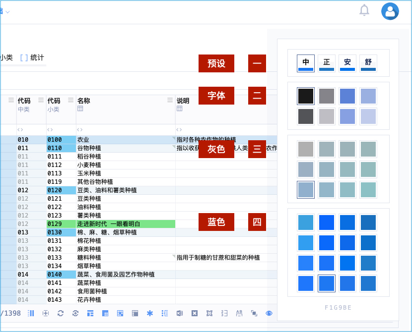

以东方文化为底蕴缔造轻奢认证机构管理系统 <br/>
适配高网速、符合时代，高维、上色、灵动 <br/>
主理人：麦修行（大江东去，唯我修行）

[麦修行][]&nbsp;&nbsp;&nbsp;&nbsp;[AI->东方神功][东方神功]&nbsp;[剧情][]&nbsp;[人物][]&nbsp;&nbsp;&nbsp;&nbsp;[原理][]&nbsp;&nbsp;[规则][]&nbsp;&nbsp;[价格][]&nbsp;&nbsp;[购买][]&nbsp;&nbsp;&nbsp;&nbsp;[大模型-符文][]&nbsp;&nbsp;&nbsp;&nbsp;[发展历程][]

[麦修行]: https://github.com/ca3w/BEST/
[东方神功]: https://github.com/ca3w/ai-dongfangshengong/
[剧情]: https://github.com/ca3w/dongfangernvqing/blob/main/root/BEST.md
[人物]: https://github.com/ca3w/dongfangernvqing/blob/main/root/renwu.md
[原理]: https://github.com/ca3w/key/
[规则]: https://github.com/ca3w/rule/
[价格]: https://github.com/ca3w/pricing/
[购买]: https://github.com/ca3w/howtobuy/
[大模型-符文]: https://github.com/ca3w/largemodel-rune/
[发展历程]: https://github.com/ca3w/development/

***

[神功][]：&nbsp;[九剑][]&nbsp;&nbsp;&nbsp;[飞针][]&nbsp;&nbsp;&nbsp;[莫言][]&nbsp;&nbsp;&nbsp;[神驭][]&nbsp;&nbsp;&nbsp;[归宗][]&nbsp;&nbsp;&nbsp;[万行][]&nbsp;&nbsp;&nbsp;[幻叶][]&nbsp;&nbsp;&nbsp;[密语][]&nbsp;&nbsp;&nbsp;[六彩][]&nbsp;&nbsp;&nbsp;[箭术][]&nbsp;&nbsp;&nbsp;[神意][]&nbsp;&nbsp;&nbsp;[千依][]&nbsp;&nbsp;&nbsp;[八音][]&nbsp;&nbsp;&nbsp;[道意][]&nbsp;&nbsp;&nbsp;|&nbsp;&nbsp;&nbsp;[兵法][]：&nbsp;[关中][]&nbsp;&nbsp;&nbsp;[治粟][]&nbsp;&nbsp;&nbsp;|&nbsp;&nbsp;&nbsp;[阵法][]：&nbsp;[清上][]

[神功]: https://github.com/ca3w/ai-dongfangshengong

[九剑]: ../../wugong/fuyaojiujian/BEST.md
[飞针]: ../../wugong/feizhenbaodian/BEST.md
[莫言]: ../../wugong/moyan/BEST.md
[神驭]: ../../wugong/shenyu/BEST.md
[归宗]: ../../wugong/baichuanguizong/BEST.md
[万行]: ../../wugong/yufengwanxing/BEST.md
[幻叶]: ../../wugong/huanyezhi/BEST.md
[密语]: ../../wugong/chenqiaomiyu/BEST.md
[六彩]: ../../wugong/liucaishenjian/BEST.md
[箭术]: ../../wugong/linjiajianshu/BEST.md
[神意]: ../../wugong/shenyiduoxinzhao/BEST.md
[千依]: ../../wugong/qianyizijian/BEST.md
[八音]: ../../wugong/bayinshengxin/BEST.md
[道意]: ../../wugong/daoyicuican/BEST.md

[兵法]: https://github.com/ca3w/ai-dongfangshengong#兵法目录

[关中]: ../../bingfa/guanzhongzhanfa/BEST.md
[治粟]: ../../bingfa/zhisubingfa/BEST.md

[阵法]: https://github.com/ca3w/ai-dongfangshengong#阵法目录

[清上]: ../../zhenfa/qingshangbeidouzhen/BEST.md

# 道意璀粲

简称：道意

## 石壁有字

&nbsp;&nbsp;&nbsp;&nbsp;&nbsp;&nbsp;&nbsp;&nbsp;&nbsp;&nbsp;&nbsp;&nbsp;&nbsp;&nbsp;《道意璀粲》 <br/>
&nbsp;&nbsp;&nbsp;&nbsp;&nbsp;&nbsp;&nbsp;&nbsp;放柴奔新，渐入佳境。 <br/>
&nbsp;&nbsp;&nbsp;&nbsp;&nbsp;&nbsp;&nbsp;&nbsp;一二三四，云淡风轻。

## 道意璀粲


> 此功能画面太多，图片不足以表现，抖音西瓜、微信的视频号，搜 ca3wBEST / ca3w麦修行 看视频

***

## 现实世界

认证机构信息管理系统 中的 「主题」（皮肤）

## 武侠世界

气功心法 <br/>
扶摇子 除扶摇九剑之外的 一种道家心法 <br/>
扶摇子于重伤之际，传功于穿越主（审核员东方正美）

## 术语对照

武学术语  |系统术语  |说明
:---------|:---------|:-----
道意璀粲  |主题      |皮肤

## 作者笔记

```text
(2x4) X (3x4) X (4x4) = 1536
一共有1536种，总能选出一个你喜欢的
```
