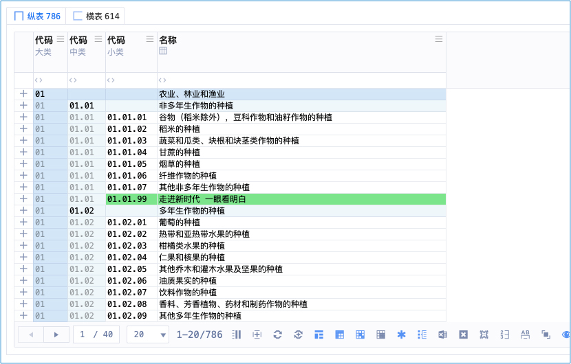
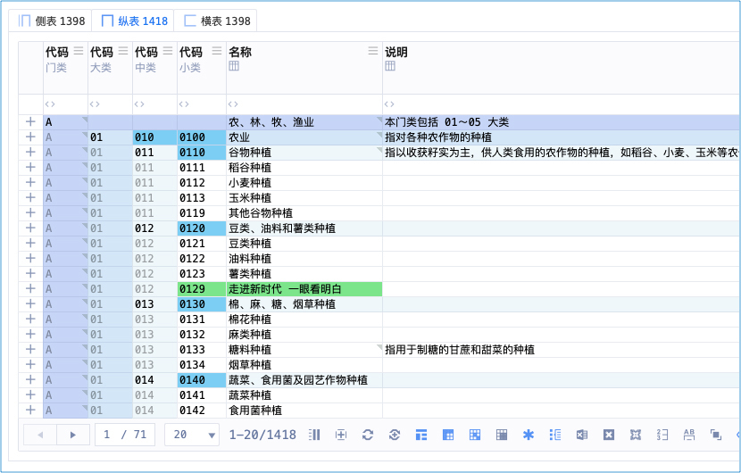
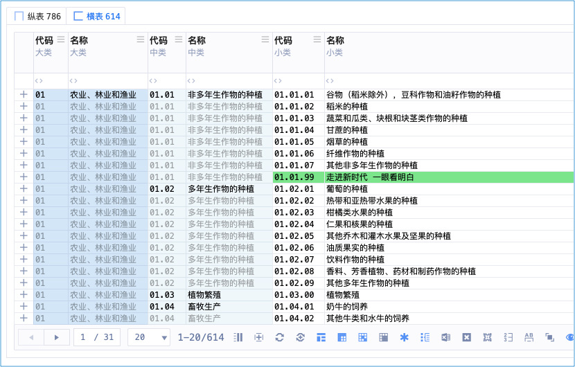
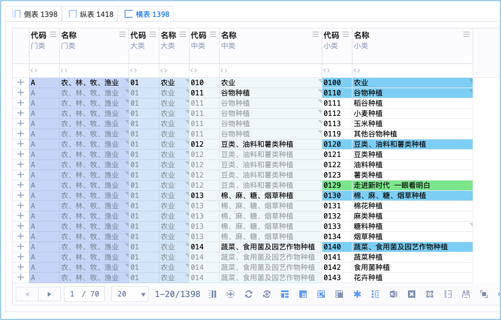
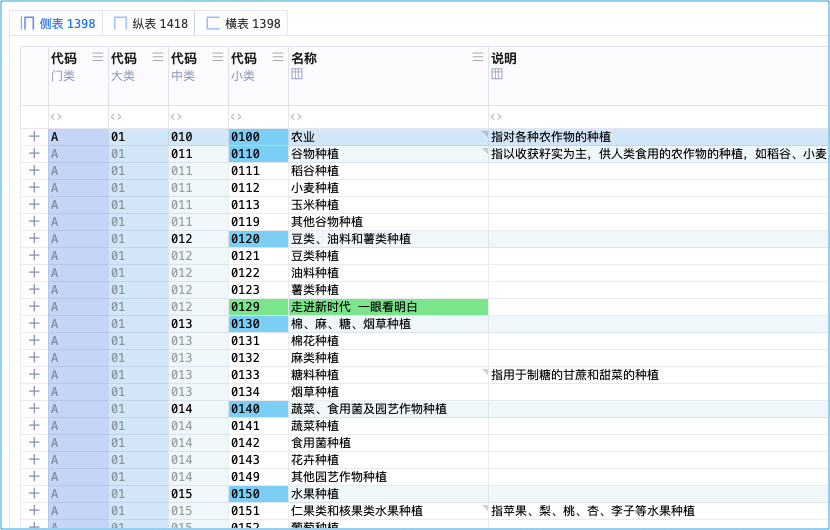

以东方文化为底蕴缔造轻奢认证机构管理系统 <br/>
适配高网速、符合时代，高维、上色、灵动 <br/>
主理人：麦修行（大江东去，唯我修行）

[麦修行][]&nbsp;&nbsp;&nbsp;&nbsp;[AI->东方神功][东方神功]&nbsp;[剧情][]&nbsp;[人物][]&nbsp;&nbsp;&nbsp;&nbsp;[原理][]&nbsp;&nbsp;[规则][]&nbsp;&nbsp;[价格][]&nbsp;&nbsp;[购买][]&nbsp;&nbsp;&nbsp;&nbsp;[Excel-Email][]&nbsp;[大模型-符文][]&nbsp;&nbsp;&nbsp;&nbsp;[发展历程][]

[麦修行]: https://github.com/ca3w/BEST
[东方神功]: https://github.com/ca3w/ai-dongfangshengong
[剧情]: https://github.com/ca3w/dongfangernvqing/blob/main/root/BEST.md
[人物]: https://github.com/ca3w/dongfangernvqing/blob/main/root/renwu.md
[原理]: https://github.com/ca3w/key
[规则]: https://github.com/ca3w/rule
[价格]: https://github.com/ca3w/pricing
[购买]: https://github.com/ca3w/howtobuy
[Excel-Email]: https://github.com/ca3w/excel-email
[大模型-符文]: https://github.com/ca3w/largemodel-rune
[发展历程]: https://github.com/ca3w/development

***

[神功][]：&nbsp;[九剑][]&nbsp;&nbsp;&nbsp;[飞针][]&nbsp;&nbsp;&nbsp;[莫言][]&nbsp;&nbsp;&nbsp;[神驭][]&nbsp;&nbsp;&nbsp;[归宗][]&nbsp;&nbsp;&nbsp;[万行][]&nbsp;&nbsp;&nbsp;[幻叶][]&nbsp;&nbsp;&nbsp;[密语][]&nbsp;&nbsp;&nbsp;[六彩][]&nbsp;&nbsp;&nbsp;[箭术][]&nbsp;&nbsp;&nbsp;[神意][]&nbsp;&nbsp;&nbsp;[千依][]&nbsp;&nbsp;&nbsp;[八音][]&nbsp;&nbsp;&nbsp;[道意][]&nbsp;&nbsp;&nbsp;|&nbsp;&nbsp;&nbsp;[兵法][]：&nbsp;[关中][]&nbsp;&nbsp;&nbsp;[治粟][]&nbsp;&nbsp;&nbsp;|&nbsp;&nbsp;&nbsp;[阵法][]：&nbsp;[清上][]

[神功]: https://github.com/ca3w/ai-dongfangshengong

[九剑]: ../../wugong/fuyaojiujian/BEST.md
[飞针]: ../../wugong/feizhenbaodian/BEST.md
[莫言]: ../../wugong/moyan/BEST.md
[神驭]: ../../wugong/shenyu/BEST.md
[归宗]: ../../wugong/baichuanguizong/BEST.md
[万行]: ../../wugong/yufengwanxing/BEST.md
[幻叶]: ../../wugong/huanyezhi/BEST.md
[密语]: ../../wugong/chenqiaomiyu/BEST.md
[六彩]: ../../wugong/liucaishenjian/BEST.md
[箭术]: ../../wugong/linjiajianshu/BEST.md
[神意]: ../../wugong/shenyiduoxinzhao/BEST.md
[千依]: ../../wugong/qianyizijian/BEST.md
[八音]: ../../wugong/bayinshengxin/BEST.md
[道意]: ../../wugong/daoyicuican/BEST.md

[兵法]: https://github.com/ca3w/ai-dongfangshengong#兵法目录

[关中]: ../../bingfa/guanzhongzhanfa/BEST.md
[治粟]: ../../bingfa/zhisubingfa/BEST.md

[阵法]: https://github.com/ca3w/ai-dongfangshengong#阵法目录

[清上]: ../../zhenfa/qingshangbeidouzhen/BEST.md

# 扶摇九剑

简称：九剑

## 石壁有字

&nbsp;&nbsp;&nbsp;&nbsp;&nbsp;&nbsp;&nbsp;&nbsp;&nbsp;&nbsp;&nbsp;&nbsp;&nbsp;&nbsp;&nbsp;&nbsp;&nbsp;&nbsp;&nbsp;&nbsp;&nbsp;&nbsp;&nbsp;&nbsp;&nbsp;《扶摇九剑》 <br/>
&nbsp;&nbsp;&nbsp;&nbsp;&nbsp;&nbsp;&nbsp;&nbsp;扶摇直上九剑飞，有进无退意不归。 <br/>
&nbsp;&nbsp;&nbsp;&nbsp;&nbsp;&nbsp;&nbsp;&nbsp;冲破拘束得大妙，纵横宇宙我最威。

## 总决式

```text
归妹趋无妄，
无妄趋同人，
同人趋大有。

纵剑最高横辅之，
纵剑小雕为落剑，
横剑小雕为荡剑。

纵剑门类转横为侧，
横剑门类转纵为归，
多合集归、余者奇。
```

## 纵剑式





## 横剑式





## 落剑式


## 荡剑式


## 侧剑式



## 归剑式

## 合剑式

## 集剑式

## 奇剑式

***

## 现实世界

认证机构信息管理系统 中的 「高维」

## 武侠世界

天下第一剑法 <br/>
五绝：南扶 · 扶摇子 成名绝技 <br/>
扶摇子于重伤之际，传功于穿越主（审核员东方正美）

## 术语对照

武学术语  |系统术语  |说明
:---------|:---------|:-------------------
九剑      |高维      |高维表格
纵剑式    |纵表      |表就是剑、剑就是表
横剑式    |横表      |
落剑式    |落表      |
荡剑式    |荡表      |
侧剑式    |侧表      |
归剑式    |归表      |
合剑式    |合表      |
集剑式    |集表      |
奇剑式    |奇表      |

## 作者笔记

```text
第一剑：纵剑式 - 纵表
第二剑：横剑式 - 横表
第三剑：落剑式 - 落表
第四剑：荡剑式 - 荡表
第五剑：侧剑式 - 侧表
第六剑：归剑式 - 归表
第七剑：合剑式 - 合表
第八剑：集剑式 - 集表
第九剑：奇剑式 - 奇表

主要就是：纵、横、落、荡
    纵横是最基础的剑招
    纵 x 小类雕栏 = 落
    横 x 小类雕栏 = 荡

落、荡的命名由来：
    落的命名逻辑：
        是要给：纵表中有小类雕栏（花）的这种表、命名
            小类雕栏就像花一样
        数据如水、纵向的水，所以引申出雨水，落下成花，所以叫：落（二者要成对，都要草字头、三点水这种字）
    荡的命名逻辑：
        是要给：横表中有小类雕栏（花）的这种表、命名
        数据如水、横向的水，所以引申出海水，激荡成花，所以叫：荡（二者要成对，都要草字头、三点水这种字）
    雅意：一个是纵向雨水落下成花，一个是横向海水激荡成花，落、荡由此得名

其余看看就行，不必执着

要你一夜学会，恐怕有点强人所难
你学不学得成，就看你的悟性了
```

```text
自用注释

以行业表的 门类、大类、中类、小类 为例：
纵剑式
横剑式

落剑式 标准纵表的基础上 小类雕栏（《雕栏剑法》）
    纵剑小雕为落剑 纵剑小类雕栏为落剑
荡剑式 标准横表的基础上 小类雕栏（《雕栏剑法》）
    横剑小雕为荡剑 横剑小类雕栏为荡剑

侧剑式 先横后纵，为侧，一般是一列甩在边上，突出后面的纵的意思
    纵剑门类转横为侧剑
归剑式 先纵后横，为侧，有归纳的意思

合剑式 多表合并（基础代码）
集剑式 集剑归宗

奇剑式 其他谓之奇

***

GIF制作
    录屏 830x530
        5秒 动 10秒 停
        结果得到 11s 12s 的
    Keynote 830x530 大小一致，拖入视频，导出 `影片...` 自定 830x530 大小一致
        压缩类型选择 「Apple ProRes 4444」 会更清楚、效果好、不失真
    然后使用 PicGIF 12秒30帧 转为 gif

    小技巧：颜色全绿失真，删去第一帧，再生成就好了
```
