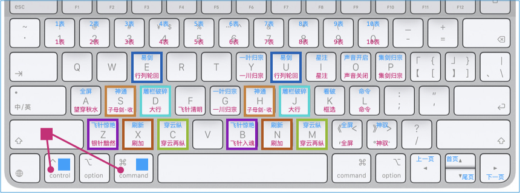

以东方文化为底蕴缔造轻奢认证机构管理系统 <br/>
适配高网速、符合时代，高维、上色、灵动 <br/>
主理人：麦修行（大江东去，唯我修行）

[麦修行][]&nbsp;&nbsp;&nbsp;&nbsp;[AI->东方神功][东方神功]&nbsp;[剧情][]&nbsp;[人物][]&nbsp;&nbsp;&nbsp;&nbsp;[原理][]&nbsp;&nbsp;[规则][]&nbsp;&nbsp;[价格][]&nbsp;&nbsp;[购买][]&nbsp;&nbsp;&nbsp;&nbsp;[Excel-Email][]&nbsp;[大模型-符文][]&nbsp;&nbsp;&nbsp;&nbsp;[发展历程][]

[麦修行]: https://github.com/ca3w/BEST
[东方神功]: https://github.com/ca3w/ai-dongfangshengong
[剧情]: https://github.com/ca3w/dongfangernvqing/blob/main/root/BEST.md
[人物]: https://github.com/ca3w/dongfangernvqing/blob/main/root/renwu.md
[原理]: https://github.com/ca3w/key
[规则]: https://github.com/ca3w/rule
[价格]: https://github.com/ca3w/pricing
[购买]: https://github.com/ca3w/howtobuy
[Excel-Email]: https://github.com/ca3w/excel-email
[大模型-符文]: https://github.com/ca3w/largemodel-rune
[发展历程]: https://github.com/ca3w/development

***

[神功][]：&nbsp;[九剑][]&nbsp;&nbsp;&nbsp;[飞针][]&nbsp;&nbsp;&nbsp;[莫言][]&nbsp;&nbsp;&nbsp;[神驭][]&nbsp;&nbsp;&nbsp;[归宗][]&nbsp;&nbsp;&nbsp;[万行][]&nbsp;&nbsp;&nbsp;[幻叶][]&nbsp;&nbsp;&nbsp;[密语][]&nbsp;&nbsp;&nbsp;[六彩][]&nbsp;&nbsp;&nbsp;[箭术][]&nbsp;&nbsp;&nbsp;[神意][]&nbsp;&nbsp;&nbsp;[千依][]&nbsp;&nbsp;&nbsp;[八音][]&nbsp;&nbsp;&nbsp;[道意][]&nbsp;&nbsp;&nbsp;|&nbsp;&nbsp;&nbsp;[兵法][]：&nbsp;[关中][]&nbsp;&nbsp;&nbsp;[治粟][]&nbsp;&nbsp;&nbsp;|&nbsp;&nbsp;&nbsp;[阵法][]：&nbsp;[清上][]

[神功]: https://github.com/ca3w/ai-dongfangshengong

[九剑]: ../../wugong/fuyaojiujian/BEST.md
[飞针]: ../../wugong/feizhenbaodian/BEST.md
[莫言]: ../../wugong/moyan/BEST.md
[神驭]: ../../wugong/shenyu/BEST.md
[归宗]: ../../wugong/baichuanguizong/BEST.md
[万行]: ../../wugong/yufengwanxing/BEST.md
[幻叶]: ../../wugong/huanyezhi/BEST.md
[密语]: ../../wugong/chenqiaomiyu/BEST.md
[六彩]: ../../wugong/liucaishenjian/BEST.md
[箭术]: ../../wugong/linjiajianshu/BEST.md
[神意]: ../../wugong/shenyiduoxinzhao/BEST.md
[千依]: ../../wugong/qianyizijian/BEST.md
[八音]: ../../wugong/bayinshengxin/BEST.md
[道意]: ../../wugong/daoyicuican/BEST.md

[兵法]: https://github.com/ca3w/ai-dongfangshengong#兵法目录

[关中]: ../../bingfa/guanzhongzhanfa/BEST.md
[治粟]: ../../bingfa/zhisubingfa/BEST.md

[阵法]: https://github.com/ca3w/ai-dongfangshengong#阵法目录

[清上]: ../../zhenfa/qingshangbeidouzhen/BEST.md

# 神意夺心爪

简称：神意

## 石壁有字

&nbsp;&nbsp;&nbsp;&nbsp;&nbsp;&nbsp;&nbsp;&nbsp;&nbsp;&nbsp;&nbsp;&nbsp;&nbsp;&nbsp;&nbsp;&nbsp;《神意夺心爪》 <br/>
&nbsp;&nbsp;&nbsp;&nbsp;&nbsp;&nbsp;&nbsp;&nbsp;划破长空影，上品神爪功。 <br/>
&nbsp;&nbsp;&nbsp;&nbsp;&nbsp;&nbsp;&nbsp;&nbsp;内劲运于掌，隔空意夺心。

## 神意夺心爪


> 此功能画面太多，图片不足以表现，抖音西瓜、微信的视频号，搜 ca3wBEST / ca3w麦修行 看视频

神意夺心爪，全名：神意夺心超爪（神意夺心 超级厉害的 爪）

神意夺心爪=SEDXZ、神意夺心超爪=SEDXCZ，主键区的几个键，经常用的

区域  |招式      |说明                  |快捷键           |这样记                |备用键
:----:|:---------|:---------------------|:----------------|:---------------------|:--------:
神 S  |神通      |弹指神通（飞针宝典）  |🎹 + S          |神通的神 Shén S       |`S => H`
神 S  |子剑东流  |子母剑·收（莫言）     |🎹 + Shift + S  |收剑的收 Shōu S       |`S => H`
意 E  |易剑      |基本功                |🎹 + E          |Excel的易 E           |`E => U`
意 E  |行列轮回  |基本功                |🎹 + Shift + E  |Excel的易 E           |`E => U`
夺 D  |雕栏破碎  |莫言                  |🎹 + D          |雕栏的雕 Diāo D       |`D => J`
夺 D  |大行      |基本功                |🎹 + Shift + D  |大行的大 Dà D         |`D => J`
心 X  |刷新      |基本功                |🎹 + X          |X 就像台词「叉出去」  |`X => N`
心 X  |刷加      |基本功                |🎹 + Shift + X  |X 叉掉数据=刷掉数据   |`X => N`
超 C  |穿云纵    |莫言                  |🎹 + C          |穿云的穿 Chuān C      |`C => M`
超 C  |穿云再纵  |莫言                  |🎹 + Shift + C  |穿云的穿 Chuān C      |`C => M`
爪 Z  |飞针惊艳  |飞针宝典              |🎹 + Z          |飞针的针 Zhēn Z       |`Z => B`
爪 Z  |银针黯然  |飞针宝典              |🎹 + Shift + Z  |飞针的针 Zhēn Z       |`Z => B`
编外  |全屏      |基本功                |🎹 + A          |All A                 |`A => ,`
编外  |望穿秋水  |飞针宝典              |🎹 + Shift + A  |All A                 |`A => ,`
编外  |飞针清明  |飞针宝典              |🎹 + Shift + F  |飞针的飞 Fēi F        |不常用
编外  |一叶归宗  |百川归宗              |🎹 + G          |归宗的归 Guī G        |`G => Y`
编外  |一川归宗  |百川归宗              |🎹 + Shift + G  |归宗的归 Guī G        |`G => Y`
编外  |星注      |基本功                |🎹 + I          |i=星号注释            |不常用
编外  |星注      |基本功                |🎹 + Shift + I  |i=星号注释            |不常用
编外  |看破      |基本功                |🎹 + K          |看破的看 Kàn K        |不常用
编外  |框选      |基本功                |🎹 + Shift + K  |框选的框 Kuang K      |不常用
编外  |声音开启  |基本功                |🎹 + O          |🤫嘘，嘴形是O        |不常用
编外  |声音关闭  |基本功                |🎹 + Shift + O  |🤫嘘，嘴形是O        |不常用
编外  |命令      |基本功                |🎹 + L          |命令的令 Lìng L       |不常用
编外  |命令      |基本功                |🎹 + Shift + L  |命令的令 Lìng L       |不常用
编外  |神驭      |                      |🎹 + .          |                      |不常用
编外  |神驭      |                      |🎹 + Shift + .  |                      |不常用
编外  |集剑归宗  |百川归宗              |🎹 + P          |                      |不常用
编外  |集剑归宗  |百川归宗              |🎹 + Shift + P  |                      |不常用
编外  |上一页    |基本功                |🎹 + ⇦         |                      |
编外  |下一页    |基本功                |🎹 + ⇨         |                      |
编外  |首页      |基本功                |🎹 + ⇧         |                      |
编外  |尾页      |基本功                |🎹 + ⇩         |                      |
编外  |1表       |基本功                |🎹 + 1          |1表                   |
编外  |1表       |基本功                |🎹 + Shift + 1  |1表                   |
编外  |2表       |基本功                |🎹 + 2          |2表                   |
编外  |2表       |基本功                |🎹 + Shift + 2  |2表                   |
编外  |3表       |基本功                |🎹 + 3          |3表                   |
编外  |3表       |基本功                |🎹 + Shift + 3  |3表                   |
编外  |4表       |基本功                |🎹 + 4          |4表                   |不常用
编外  |4表       |基本功                |🎹 + Shift + 4  |4表                   |不常用
编外  |5表       |基本功                |🎹 + 5          |5表                   |不常用
编外  |5表       |基本功                |🎹 + Shift + 5  |5表                   |不常用
编外  |6表       |基本功                |🎹 + 6          |6表                   |不常用
编外  |6表       |基本功                |🎹 + Shift + 6  |6表                   |不常用
编外  |7表       |基本功                |🎹 + 7          |7表                   |不常用
编外  |7表       |基本功                |🎹 + Shift + 7  |7表                   |不常用
编外  |8表       |基本功                |🎹 + 8          |8表                   |不常用
编外  |8表       |基本功                |🎹 + Shift + 8  |8表                   |不常用
编外  |9表       |基本功                |🎹 + 9          |9表                   |不常用
编外  |9表       |基本功                |🎹 + Shift + 9  |9表                   |不常用
编外  |10表      |基本功                |🎹 + 0          |10表                  |不常用
编外  |10表      |基本功                |🎹 + Shift + 0  |10表                  |不常用

> 🎹 Windows 代表 Control， macOS 代表 Control 或 Command

***

## 现实世界

认证机构信息管理系统 中的 「快捷键」

## 武侠世界

赵匡胤的心腹爱将、曹彬的独门武功

## 术语对照

武学术语    |系统术语  |说明
:-----------|:---------|:-----
神意夺心爪  |快捷键    |

## 作者笔记

```text
九阴白骨爪 = 抠脑袋
神意夺心爪 = 抓心脏
    超级厉害，所以：神意夺心超爪
        神意夺心超爪=SEDXCZ
        🎹+键、🎹+Shift+键
            S=神(Shén)通、字母剑·收(Shōu)
            E=Excel，易剑、行列轮回
            D=雕(Diāo)栏破碎、大(Dà)行
            X=新(Xīn)，刷新、刷加
            C=穿(Chuān)云纵、穿(Chuān)云再纵
            Z=针(Zhēn)，飞针惊艳、银针黯然

记不住也没关系，随便按按试一试，反正你也按不坏，习惯了就记住了

command键 是 MacBook 苹果电脑里面才有的 有点相当于 control键
如果你用的是 Windows 这样理解 command键 就是 control键 就行了

🎹+A、🎹+X，这种按键的使用，不会影响全选、剪切的正常按键功能
系统会智能的判断你按键的情形，如果选中文本，识别为正常按键功能
```
